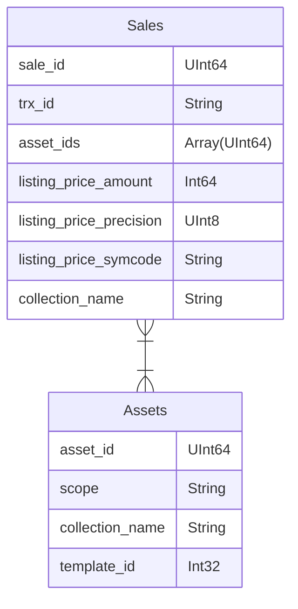

# [`Substreams`](https://substreams.streamingfast.io/) Atomic API
[](https://github.com/pinax-network/substreams-atomic-api/actions/workflows/bun-test.yml)

## REST API

| <div style="width:200px">Pathname</div>| Description           |
|----------------------------------------|-----------------------|
| GET `/health`                          | Health check
| GET `/chains`                          | Get available chains
| GET `/sales`                           | Get sales by `chain`, `collection_name`, `sale_id`, `timestamp`, `block_number`, `template_id`, `listing_price_amount`, `listing_price_symcode`, `trx_id` or `contains_asset_id`
| GET `/sales/aggregate`                 | Get aggregate of sales filtered by `chain`,`collection_name`, `listing_price_symcode`, `timestamp` or `block_number`
| GET `/metrics`                         | Prometheus metrics
| GET `/openapi`                         | [OpenAPI v3 JSON](https://spec.openapis.org/oas/v3.0.0)

Supported aggregate functions : `count`, `sum`, `min`, `max`, `avg`, `median`

Supported aggregate columns: `sale_id`, `total_asset_ids`, `listing_price_amount`

## Requirements

- [Clickhouse](https://clickhouse.com/)

Additionnaly to pull data directly from a substream:
- [Substreams Sink Clickhouse](https://github.com/pinax-network/substreams-sink-clickhouse/)

## Quickstart
```console
$ bun install
$ bun dev
```

## [`Bun` Binary Releases](https://github.com/pinax-network/substreams-sink-websockets/releases)

> Linux Only

```console
$ wget https://github.com/pinax-network/substreams-atomic-api/releases/download/v0.2.0/substreams-atomic-api
$ chmod +x ./substreams-atomic-api
```

## `.env` Environment variables

```env
# API Server
PORT=8080
HOSTNAME=localhost

# Clickhouse Database
HOST=http://127.0.0.1:8123
DATABASE=default
USERNAME=default
PASSWORD=
MAX_LIMIT=500

# Logging
VERBOSE=true
```
## Expected database structure
`substreams-sink-clickhouse` auto generates some tables (see [Database structure](https://github.com/pinax-network/substreams-sink-clickhouse#database-structure) section).
For this API to work, you will also need to provide following schemas to `substreams-sink-clickhouse` (see [Schema initialization](https://github.com/pinax-network/substreams-sink-clickhouse#schema-initialization) section):
- `substreams-atomicmarket-sales` [schema](https://github.com/pinax-network/substreams-atomicmarket-sales/blob/master/schema.sql)
- `substreams-atomicassets` [schema](https://github.com/pinax-network/substreams-atomicassets/blob/master/schema.sql)
  
The expected added tables to the database structure will then be:

## Help

```console
$ ./substreams-atomic-api -h
Usage: substreams-atomic-api [options]

Atomic API

Options:
  -V, --version            output the version number
  -p, --port <number>      HTTP port on which to attach the API (default: "8080", env: PORT)
  -v, --verbose <boolean>  Enable verbose logging (choices: "true", "false", default: false, env: VERBOSE)
  --hostname <string>      Server listen on HTTP hostname (default: "localhost", env: HOSTNAME)
  --host <string>          Database HTTP hostname (default: "http://localhost:8123", env: HOST)
  --username <string>      Database user (default: "default", env: USERNAME)
  --password <string>      Password associated with the specified username (default: "", env: PASSWORD)
  --database <string>      The database to use inside ClickHouse (default: "default", env: DATABASE)
  --max-limit <number>     Maximum LIMIT queries (default: 10000, env: MAX_LIMIT)
  -h, --help               display help for command
```

## Docker environment

Pull from GitHub Container registry
```bash
docker pull ghcr.io/pinax-network/substreams-atomic-api:latest
```

Build from source
```bash
docker build -t substreams-atomic-api .
```

Run with `.env` file
```bash
docker run -it --rm --env-file .env ghcr.io/pinax-network/substreams-atomic-api
```
